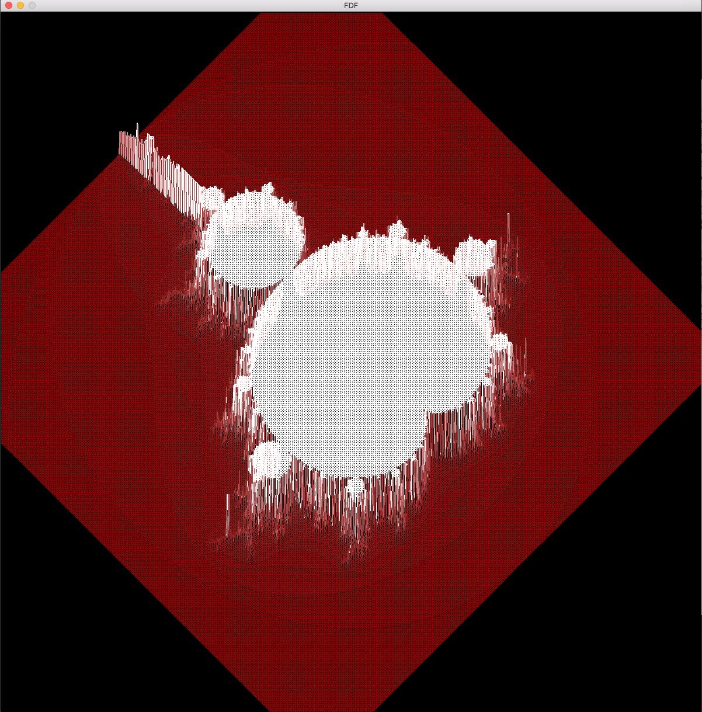
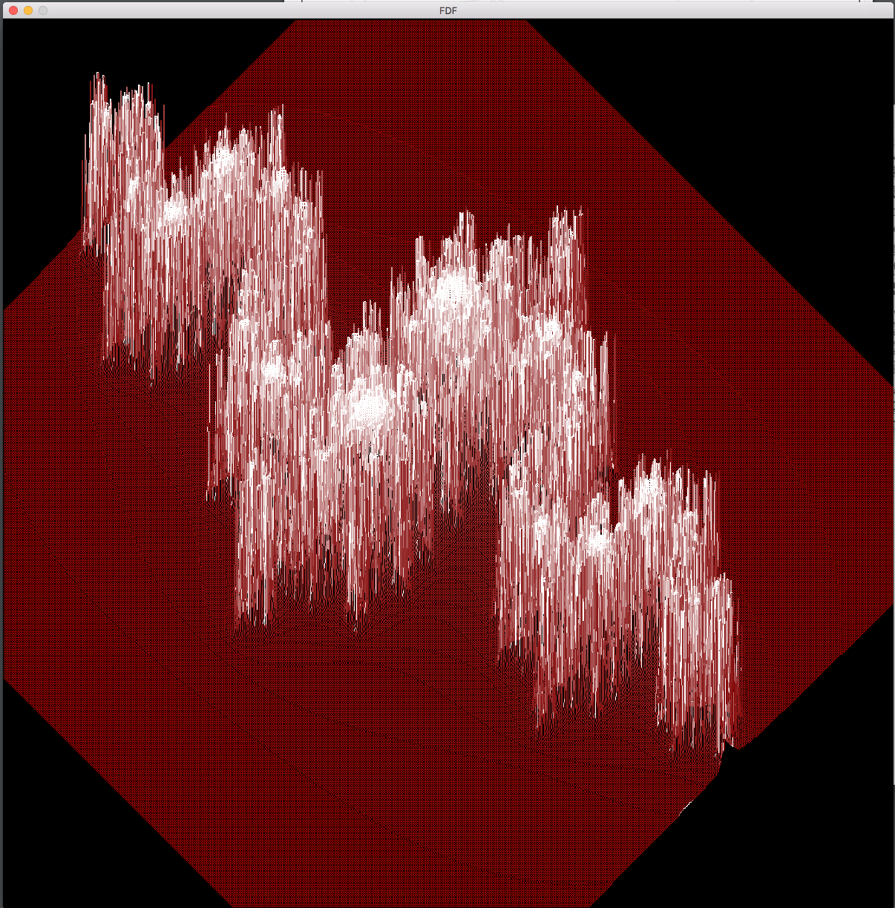
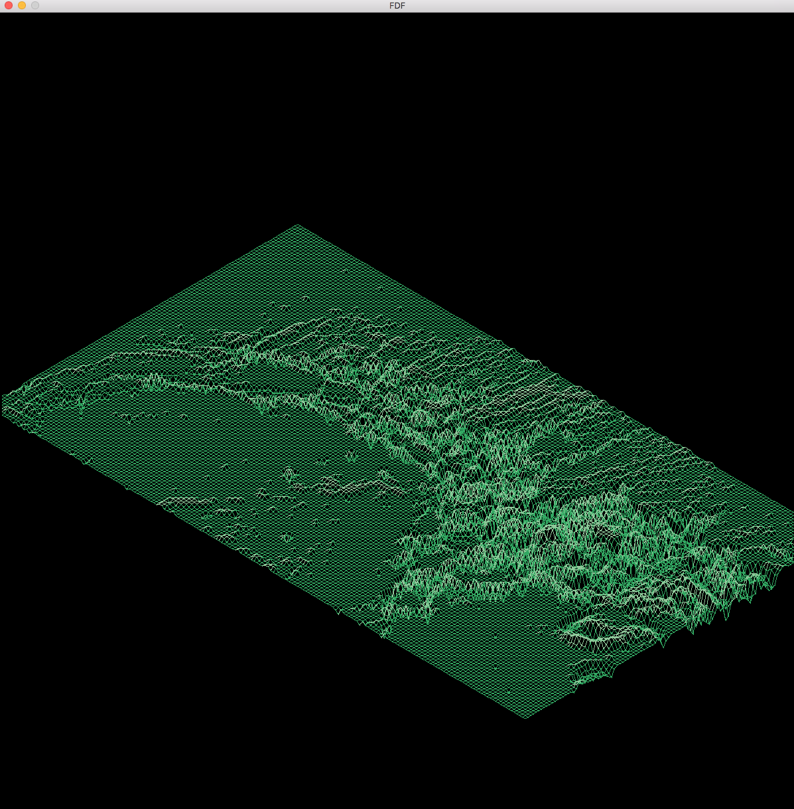
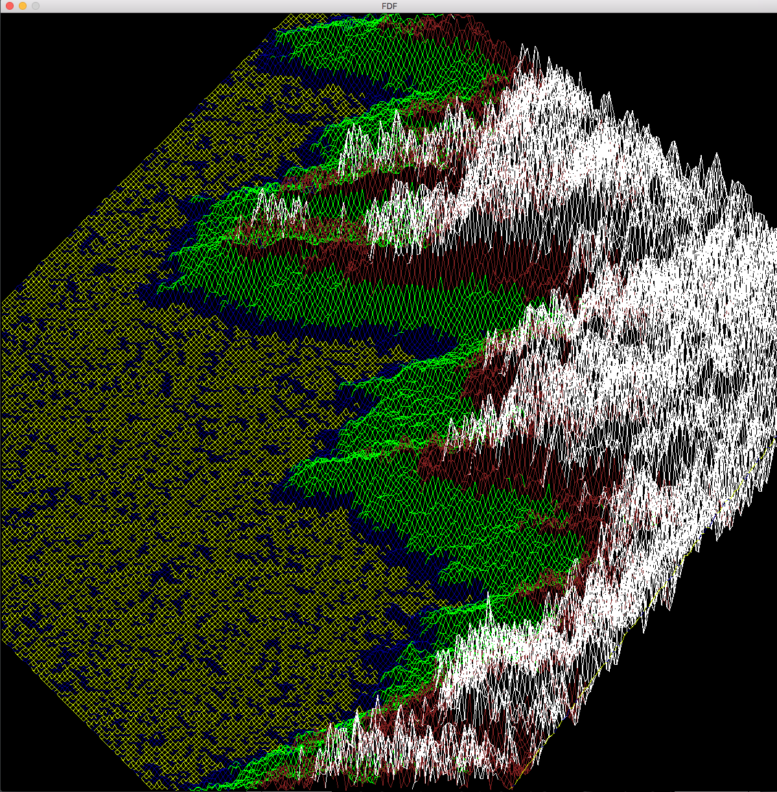
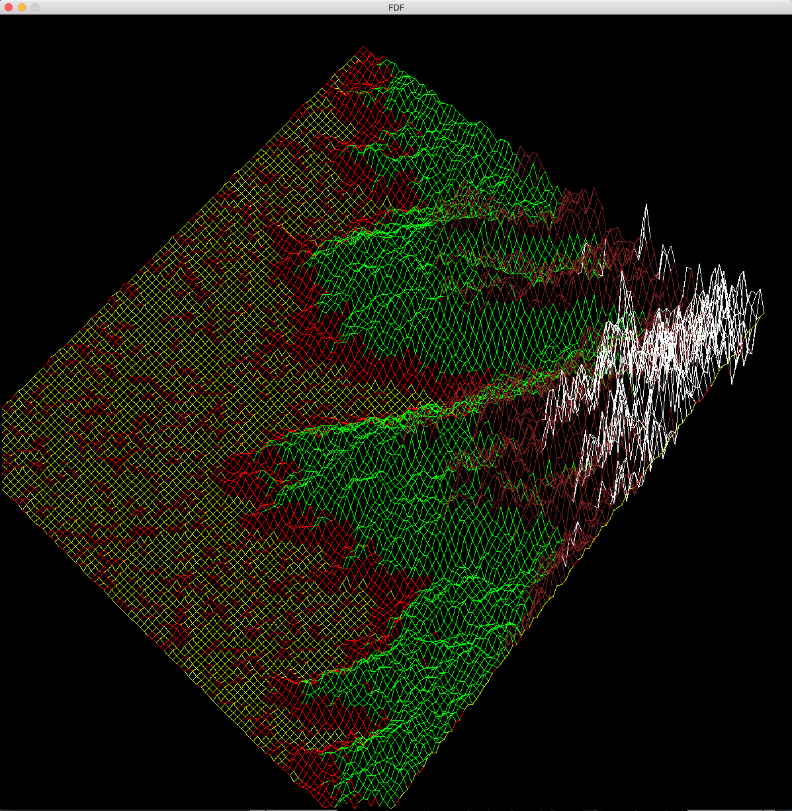
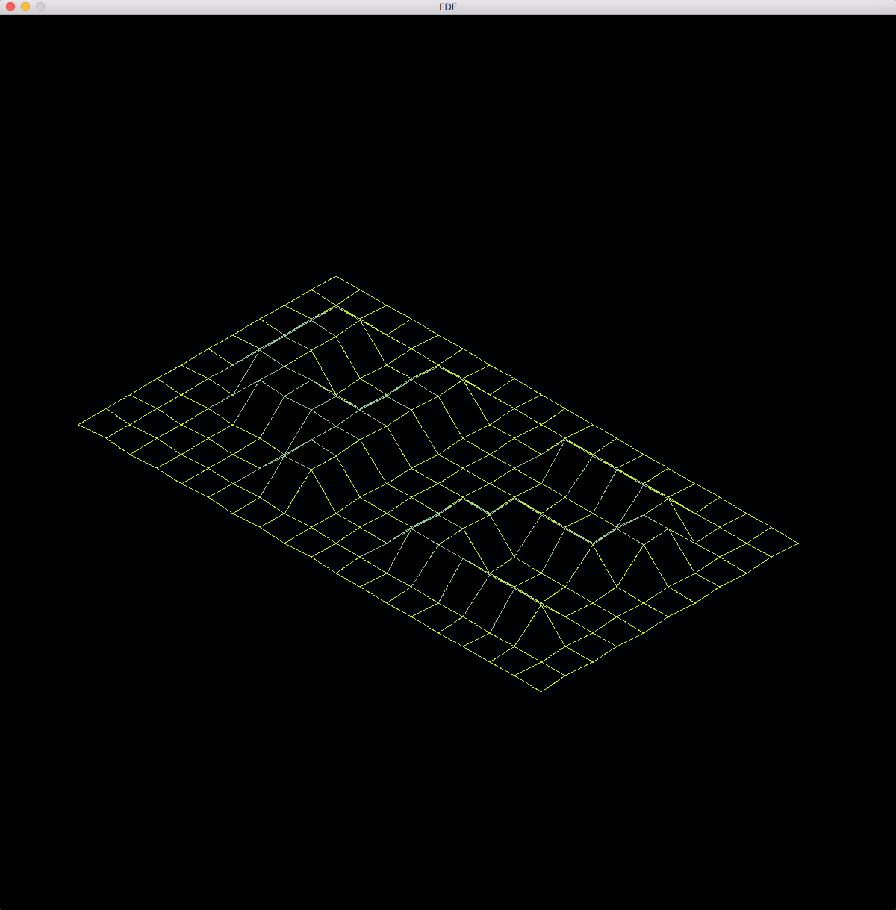

# fdf
il s'agit de 1er projet graphique de l'ecole  
La représentation en relief d’un terrain est une pratique clef de la cartographie moderne.  
Par exemple, en cette ère d’exploration spatiale, avoir une reproduction en trois 
dimensions de la surface de Mars est un prérequis indispensable à la conquête de cette 
planète. Autre exemple, comparer des représentations en trois dimensions d’une zone ou 
l’activité tectonique est importante permet de mieux comprendre ces phénomènes et leur 
évolution, permettant ainsi d’être mieux préparés. 

